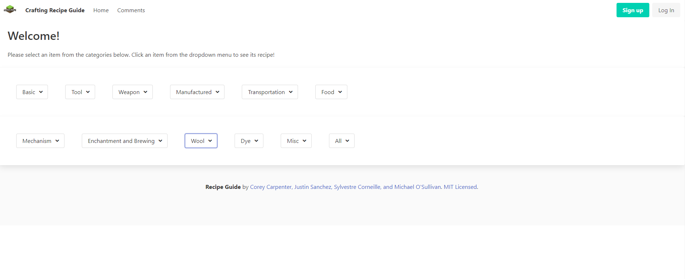
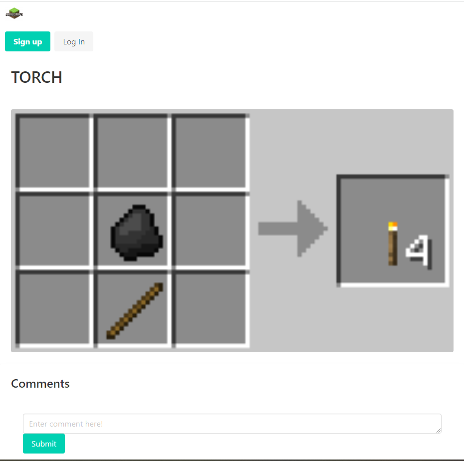

# Minecraft Crafting Recipe Guide

## Description
This purpose of this project is to create a full-stack application where the user can select a "crafting recipe" and it will display an image of that specific recipe. The application's homepage will show have a drop down bar where the user can select which item they would want to look up. Once the user selects the recipe, then the application will take them to another page where it will display the image. The homepage also contains a "Log in" feature as well as a "Comments" tab where users can send us feedback or any other types of messages. 

The UI that displays the webpages are created using the handlebars template. The images that are being displayed is through a third-party API called Cloudinary, which stores, converts, and formats images. The comments being made by users will be stored in a MySQL database.

## Installation
- Node Package Manager (npm) -> Command: "npm i"
- MySQL (mysql2) 
- Cloudinary 

## Usage
When running the application, the user will first see the homepage. The homepage will have multiple different drop down bars because the crafting recipes are categorized based on their function like weapons, tools, etc. 

When the user selects an item they want to craft, the application will send them to another webpage where it will disply an image as well as a section for users to make comments. 

## Authors
Corey Carpenter
Sylvestre Corneille
Michael O'Sullivan
Justin Sanchez

## Credit

## License
Licensed under MIT License. Please refer to the LICENSE.md in the repo. 